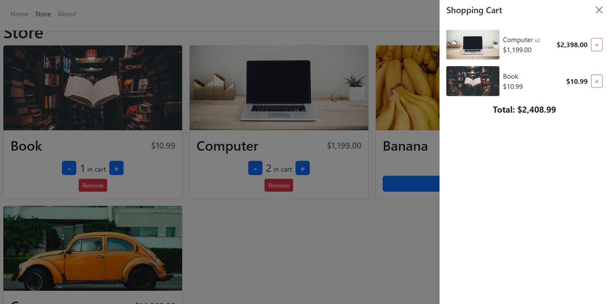

# Advanced Shopping cart

this is simple but advanced react project using raect router lib , react-Hooks ,Context
api,react-bootstrap(for styling)

you can try it out!! [here](https://contacts-project.netlify.app/)

## How to use

-   in store page click on any product to add it to your cart
-   you can use the + or - button to select the amount of each product ,or Remove button to remove
    it from cart
-   click on the cart icon in the Navbar to view to total amount of products you selected and the
    total price
-   all information saved in the browser locale storage to achieve better user experience

## sample

